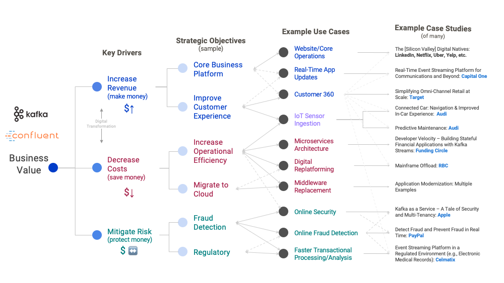

Apache Kafka is a distributed streaming platform 
================================================

A synchronous messaging, enable senders and receivers to communicate
without the restriction that both must be available listening to the
message at the same time. As the following image shows, the sender can
produce a message and whenever the receiver is available, it will read
and handle it.

Use Case:

-   Messaging

-   Logging

-   Stream Processing

Kafka has the following features in distributed communication

-   Topics

-   Partitions

-   Brokers

-   Producers

-   Consumers

-   Consumer Groups

Topic

A topic is where your messages will be sent to (produced). Whoever wants
to read this piece of information will read it (consume) from the topic.

Partition

Broker

Producers

-   Writes the messages to topic

Consumer

-   Reads the messages from topic

KafkaJs is another open source library to run with NodeJs.

Kafka runs locally in a docker container

Open-Bank use case with Kafka

<https://github.com/OpenBankProject/OBP-API/wiki/Open-Bank-Project-Architecture>

References
----------

<https://kafka.apache.org/intro>

**JS Library**: <https://kafka.js.org/docs/getting-started>
